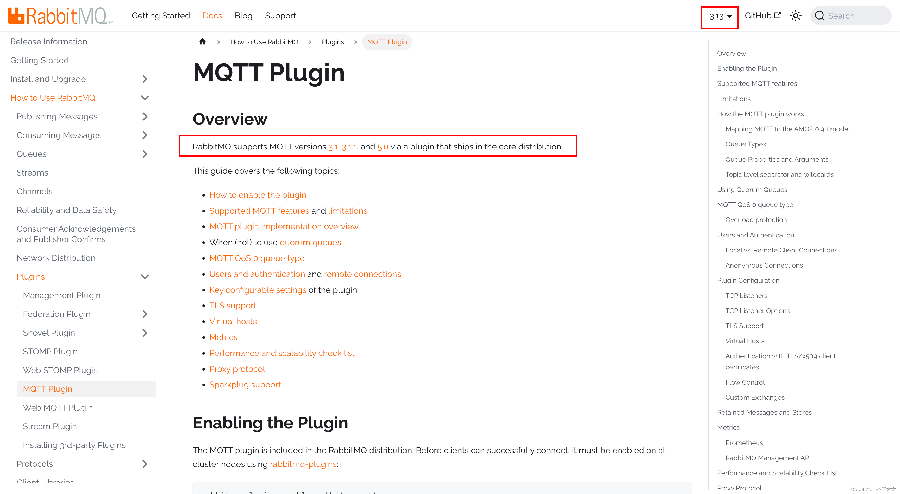
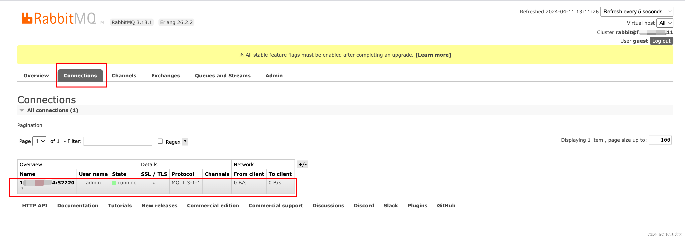
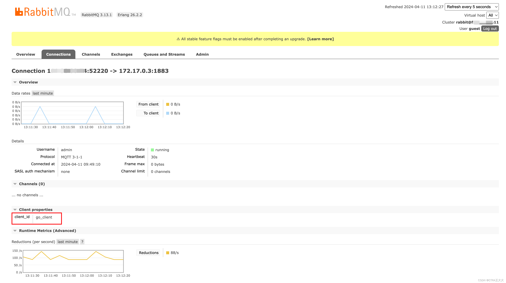
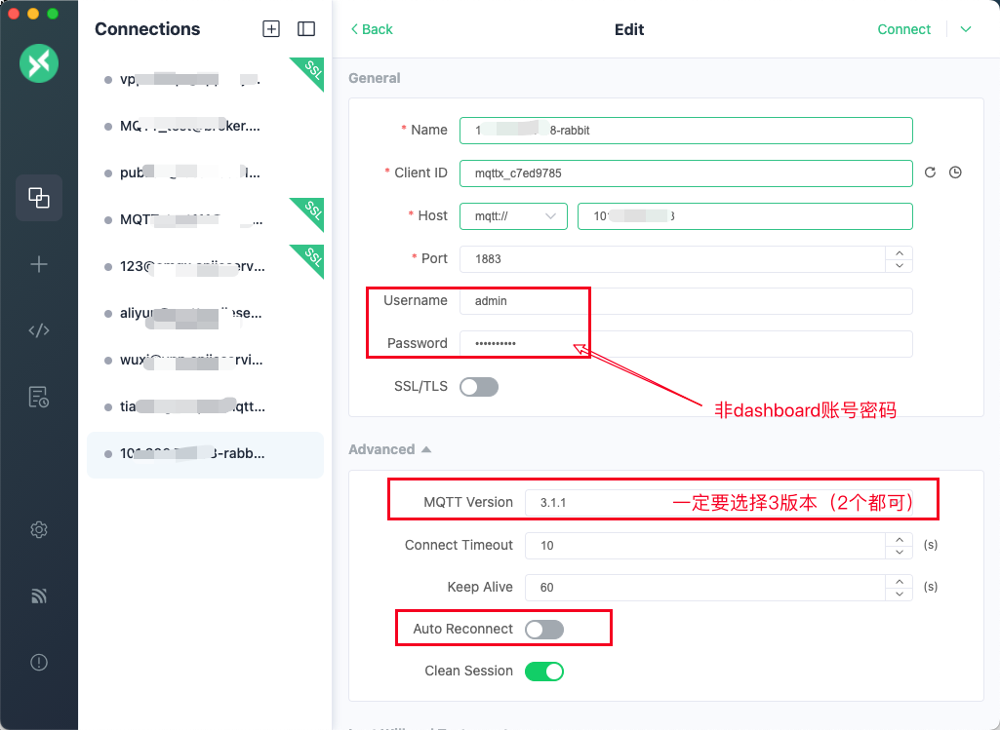

# go-mqtt-client
> 通过golang创建与MQTT协议创建的客户端连接

# 一、基于rabbitMq的MQTT

rabbitmq的官方文档地址：[https://www.rabbitmq.com/docs/mqtt](https://www.rabbitmq.com/docs/mqtt)

目前已经支持的MQTT版本如下：`3.1`、`3.1.1`、`5.0`



## 1、创建rabbitMQ 服务
> 一键拉起rabbitmq

```bash
  docker run -d --name rabbitmq --restart always -p 15672:15672 -p 5672:5672 -p 1883:1883 rabbitmq:3-management
```


### 1.1、端口说明

在使用 Docker 部署 RabbitMQ 并开通 MQTT 服务时，你需要确保以下端口在安全组中是开放的：

- **AMQP 端口**（默认端口：`5672`）： 这是 RabbitMQ 使用的端口，用于 AMQP 协议。确保你的安全组允许来自需要访问 RabbitMQ 的客户端的流量通过这个端口。

- **管理界面端口**（默认端口：`15672`）： 如果你需要访问 RabbitMQ 的 Web 管理界面，你需要开放这个端口。

- **MQTT 端口**（默认端口：`1883`）： 这是 MQTT 服务使用的端口。确保这个端口也被安全组允许通过，以便 MQTT 客户端可以连接到 RabbitMQ 的 MQTT 服务。

在我们启动docker container时，没有修改映射的端口，则可以直接使用如上端口
根据你的安全策略和网络配置，你可能还需要考虑其他端口或配置，例如 TLS 加密通信等。确保只开放必要的端口，并采取适当的安全措施来保护你的 RabbitMQ 服务。


### 1.2、dashboard - 检查 5672、1883 端口
> 使用telnet如果没有refused则说明端口放开且是通的
```bash
telnet 127.0.0.1 5672
telnet 127.0.0.1 1883
```

### 1.3、dashboard - 检查 15672 端口
> http://127.0.0.1:15672/#/  可以看到dashboard界面
> 如果我们没有在启动容器时，设置账号密码
> 则默认账号密码如下：
> 账号：`guest`
> 密码：`guest`


## 2、配置MQTT服务

### 2.1、Docker 容器中配置 MQTT 插件
要在 Docker 容器中配置 MQTT 插件： 进入 RabbitMQ 容器，启用 MQTT 插件，退出后并重新启动 RabbitMQ docker服务。

```bash
docker exec -it rabbitmq /bin/bash
rabbitmq-plugins enable rabbitmq_mqtt
# 然后退出容器
exit
```
重启RabbitMQ的docker服务

```bash
docker restart rabbitmq
```

### 2.2、配置MQTT账号密码
在默认情况下，RabbitMQ 安装后是没有账号密码的，也就是说初始情况下，你可以直接连接到 RabbitMQ 服务。但是，为了安全起见，你应该设置一个密码来保护 RabbitMQ 服务器。

你可以通过以下步骤设置 RabbitMQ 的账号密码：（`无需重启docker`）

启用 RabbitMQ 管理插件： 如果你还没有启用 RabbitMQ 的管理插件，你可以使用以下命令启用它：

```bash
rabbitmq-plugins enable rabbitmq_management
```


创建用户： 使用以下命令创建一个新用户（例如，用户名为 "admin"）：

```bash
rabbitmqctl add_user admin your_password
```


```bash
rabbitmqctl set_permissions -p / admin ".*" ".*" ".*"
```

这会创建一个名为 "admin" 的用户，并将密码设置为 "your_password"。记得将 "your_password" `替换为你想要设置的密码`。

授予管理员权限： 使用以下命令为新用户授予管理员权限：

```bash
rabbitmqctl set_user_tags admin administrator
```


设置权限： 最后，你可能需要设置权限，以便用户可以执行所需的操作。例如，你可以使用以下命令授予用户对所有虚拟主机的完全权限：

```bash
rabbitmqctl set_permissions -p / admin ".*" ".*" ".*"
```

这将为用户 "admin" 授予对所有虚拟主机的所有操作权限。


通过执行这些步骤，你就可以设置一个账号密码来保护 RabbitMQ 服务器了。确保密码足够安全，并且只向需要访问 RabbitMQ 的用户分享。


## 3、测试MQTT链接

### 2.1、golang 链接MQTT demo
> 使用代码链接MQTT 并将 `client_id` 设置为 `go_client`
```go
package main

import (
	"fmt"
	"os"
	"os/signal"
	"syscall"

	MQTT "github.com/eclipse/paho.mqtt.golang"
)

func onMessageReceived(client MQTT.Client, message MQTT.Message) {
	fmt.Printf("Received message on topic: %s\n", message.Topic())
	fmt.Printf("Message: %s\n", message.Payload())
}

func main() {
	// 创建 MQTT 连接参数
	opts := MQTT.NewClientOptions().AddBroker("tcp://your-address:your-port")
	opts.SetClientID("go_client")
	opts.SetUsername("your-username") // 设置用户名
	opts.SetPassword("your-password") // 设置密码

	// 创建 MQTT 客户端实例
	client := MQTT.NewClient(opts)

	// 连接到 MQTT 代理
	if token := client.Connect(); token.Wait() && token.Error() != nil {
		panic(token.Error())
	}

	// 订阅主题
	if token := client.Subscribe("test/topic", 0, onMessageReceived); token.Wait() && token.Error() != nil {
		panic(token.Error())
	}

	fmt.Println("Connected to MQTT broker")

	// 等待信号
	sig := make(chan os.Signal, 1)
	signal.Notify(sig, syscall.SIGINT, syscall.SIGTERM)
	<-sig

	// 断开连接
	client.Disconnect(250)
	fmt.Println("Disconnected from MQTT broker")
}

```
### 2.2、查看RabbitMQ的dashboard
> 进入到 Connections 的tabs




> 可以看到 `client_id` 是 `go_client`




### 2.3、MQTTX 链接MQTT
> 配置如下：
> 需要注意的是 `rabbitmq`的`dashboard账号密码`，与 `MQTT`的`账号密码`并不是一套

